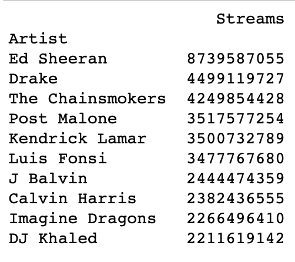
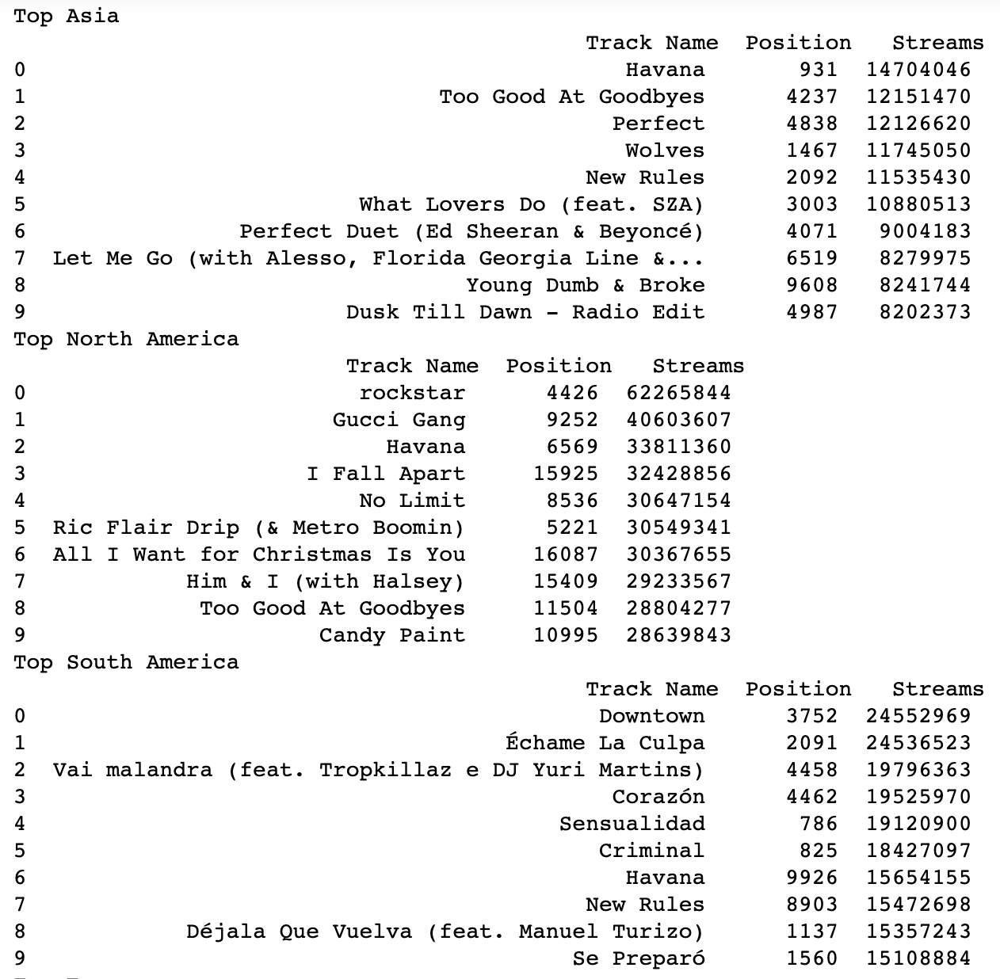
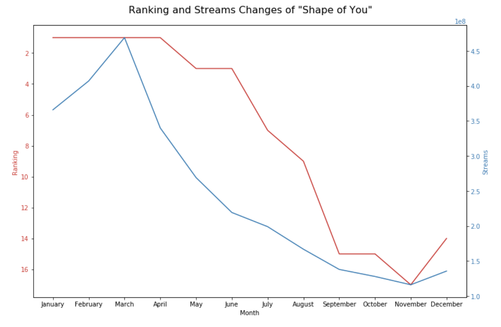

# HKUST VisLab Coding Training 
### by Renfei Huang

This is a training for the coding skills in HKUST VisLab. 
Please tolerant some not so well written/organized code segments, as they are not fully polished. 
Here are the results of each level. 

## Level 1
Level 1 covers lots of basic knowledge of D3.js, such as axis, scales, and shapes (rectangles). 
All the 4 tasks are finished in the following figures: 

- The high temperature with tooltips shown.


- The low temperature with tooltips shown.


## Level 2
Level 2 is slightly more complex, with line charts added. 
Line charts require knowledge of using paths and properly set the positions of the charts and scales, choosing the proper colors for lines, etc. 

- The high temperature with tooltips shown.


- The low temperature with tooltips shown.


## Level 3
Level 3 is both harder and eaiser, it is easy because a lot of resources can be found online that are similar. It is hard because the data structure is more complicated than Level 1 and 2. This requires some advanced use of D3.js. 

This code should be run with a simple server with command within the folder Level_3. 

```
python -m http.server 8000
```

and open up localhost:8000 we can see the result. 
In the node-link diagram, the number of coauthor papers is encoded by the radii of the circle and the width of the links. 
In the matrix view, the number of coauthor papers is encoded by the saturability of color blue. 

The results of the node-link diagram along side of the matrix view. 

- Without highlighting: 

- With highliting of Prof. Qu Huamin:

- With highliting of Prof. Qu and reorder the matrix by full name of professors:


## Level 4 
For level 4 I choosed the challenge of Spotify's Worldwide Daily Song Ranking. 

### Task 1 
The the top 10 tracks in the global throughout year 2017 with their total stream counts. 


### Task 2
List the top 10 artists (or groups) those has the most stream counts for all their tracks combined.



### Task 3
List the top 10 tracks in December, 2017 for each continent (North America, Europe, Asia, South America, Oceania).



### Task 4
Task 4 is the hardes one, with more complicated data processing. The result is shown as follows.

The figure is plotted using matplotlib. 
And here we have a simple explanation of this multi line chart. 

### A Simple Data Story

Here from the figure we can find that in March the streams number is the peek and then decrease month by month. 
For the ranking we can see that it peeks for several month then falls monthly. 
After March, although the streams drops a little, but the ranking is still 1. 
After the streams drops further, the ranking starts to fall down. 


